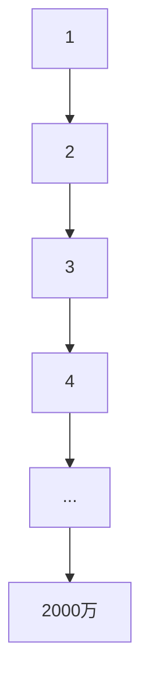
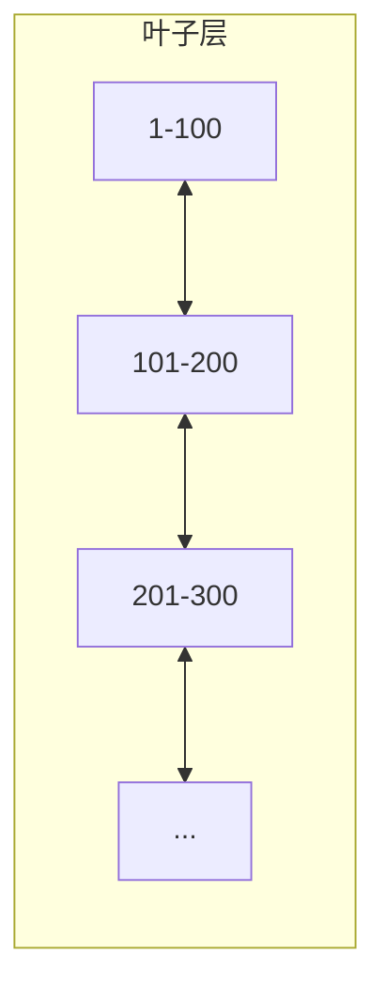
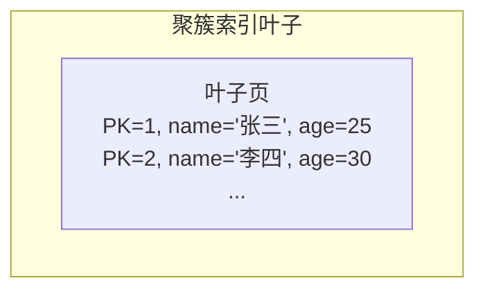
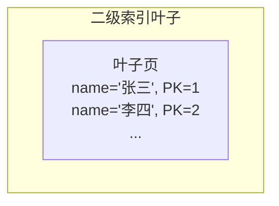
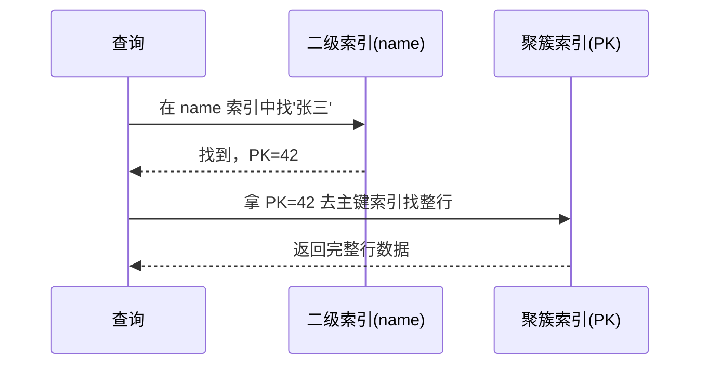

---
tags:
  - 八股
  - MySQL
  - 索引
status: 待复习
created: 2026-05-03
---

# MySQL 索引完整篇

> 想象你走进一座巨型图书馆，藏书 2000 万册。如果没有索引卡片柜，你只能逐本翻找——这就是全表扫描。MySQL 的索引，就是那张让查询从"大海捞针"变成"按图索骥"的魔法卡片。

---

## 1. 为什么选 B+ 树？

面试官问你"索引底层数据结构"时，他真正想听的是你**横向对比**的能力。把 B+ 树和它的竞争者们放在一起比，高下立判。

### 1.1 候选者逐一淘汰

#### 二叉树：一厢情愿的"理想树"



**死因：高度失控。** 如果数据按递增顺序插入，二叉树会退化成一根"面条"（链表），树高 = 数据行数 = 2000 万。每访问一个节点就是一次磁盘 IO，2000 万次 IO，查到数据时用户已经喝了三杯咖啡。

#### 红黑树：更高明的"平衡术"

红黑树通过变色和旋转维持平衡，树高 ≈ 2 × log₂N。2000 万数据，树高 ≈ 2 × 25 = 50 层。

**死因：还是太高。** 50 次磁盘 IO 依然是不可接受的。红黑树是为**内存**场景设计的（如 Java HashMap），磁盘 IO 场景下，"矮"才是核心竞争力。

#### Hash 索引：精准的快枪手

Hash(42) → 桶地址 → 直接取出。等值查询 O(1)，快到飞起。

**死因：三大命门。**
- **不支持范围查询：** `WHERE age > 18` 时 Hash 彻底傻眼——因为 `Hash(19)` 和 `Hash(20)` 的存储位置没有任何相关性。
- **不支持排序：** `ORDER BY age` 需要额外排序。
- **Hash 冲突：** 冲突多时退化成链表遍历。

> 补充：InnoDB 的**自适应哈希索引 (Adaptive Hash Index)** 是访问模式检测到热点后自动在内存中构建的 Hash 索引，属于缓存层的加速手段，不影响磁盘结构。

#### B 树：只差一步的"前浪"

B 树和 B+ 树像一对孪生兄弟，区别在于两个关键设计：

| 特性 | B 树 | B+ 树 |
|------|------|-------|
| 非叶子节点存数据？ | 是 | 否（只存 key） |
| 叶子节点有链表？ | 无 | 有双向链表 |
| 数据出现次数 | 每个节点都有 | 只在叶子节点 |

**死因：**
- 非叶节点存数据 → 每一页能放的 key 变少 → 树更高 → IO 更多。
- 没有链表 → 范围查询要反复从根节点下探。

### 1.2 B+ 树：三条锦囊妙计

#### 第一条：非叶子节点只存 Key——"让每一页塞得下更多路牌"

> 把非叶子节点想象成高速公路上的指路牌。指路牌只需要告诉你去哪里（key），不需要把目的地的所有信息（整行数据）都刻在牌子上。

InnoDB 默认一页 16KB。假设：
- 主键 bigint: **8 字节**
- 指针: **6 字节**
- 一个 key+pointer 对: **14 字节**
- 一页大约能放: **16KB / 14B ≈ 1170 个 key**

> 这叫**扇出度 (fanout)**——每个分支能长出 1170 个子节点。

B+ 树三层结构：
- **第一层（根节点）：** 1 页，1170 个分支
- **第二层：** 1170 页，每页 1170 个分支 → 1170 × 1170 ≈ **137 万个分支**
- **第三层（叶子节点）：** 137 万页，每页假设存 16 行数据 → 137 万 × 16 ≈ **2190 万行**

**结论：一颗 3 层高的 B+ 树可以装下 2000 万行数据。一次查询只需要 2-3 次磁盘 IO（根节点常驻内存时只需 2 次）。**

#### 第二条：叶子节点双向链表——"范围查询的高速公路"



查到起点后，沿着链表直接"滑"过去，不需要反复从根节点下探。`WHERE id BETWEEN 100 AND 200` 在 B+ 树上是**一次定位 + 顺藤摸瓜**；在 B 树上则需要多次"回到树顶再下来"。

#### 第三条：数据全在叶子——"稳定得让人安心"

无论查哪一行，路径长度完全一致（树高 N = log_fanout(总行数)）。不会像 B 树那样，运气好查根节点就命中，运气差要跑到最深。这个**稳定的 O(log N)** 是数据库优化器的定心丸。

### 1.3 IO 计算精要（面试脱口而出）

```
1170 × 1170 × 16 ≈ 2190 万行
↓
3 层 B+ 树 → 2~3 次 IO → 2000 万级数据
```

> 面试金句：**"B+ 树的高度 = log_扇出度(数据量)。扇出度约 1000+，因此千万级数据只需 2-3 次磁盘 IO。"**

---

## 2. 索引类型一览

MySQL 的索引家族有七兄弟，各怀绝技：

| 索引类型                   | 一句话理解       | 关键特征                        | 存储引擎限制               |
| ---------------------- | ----------- | --------------------------- | -------------------- |
| **主键索引** (Primary Key) | 每张表的"身份证"   | 唯一 + 非空；InnoDB 下就是聚簇索引      | 一表一个                 |
| **唯一索引** (Unique)      | 带"安检门"的索引   | 值唯一，可以有 NULL（多个 NULL 不冲突）   | 所有引擎                 |
| **普通索引** (Normal)      | 不带约束的加速器    | 可重复，可 NULL                  | 所有引擎                 |
| **前缀索引** (Prefix)      | 只记身份证号前 6 位 | 对列值前 N 字符建索引，省空间            | 所有引擎                 |
| **全文索引** (Fulltext)    | 文章搜索引擎      | 基于倒排索引，支持 `MATCH...AGAINST` | InnoDB 5.6+ / MyISAM |
| **联合索引** (Composite)   | 组合拳         | 多列组合成索引，有最左前缀规则             | 所有引擎                 |
| **空间索引** (Spatial)     | 地理位置定位      | R 树结构，支持 `MBRContains` 等    | MyISAM / InnoDB 5.7+ |

### 特殊的 Hash 索引

- **Memory 引擎**支持显式的 Hash 索引（建表时指定 `USING HASH`）。
- **InnoDB 自适应哈希索引 (AHI)**：InnoDB 自动检测到某些热点页被频繁以相同模式访问时，会在 Buffer Pool 内部构建 Hash 索引，对用户透明。

> 面试一问：**"MySQL 支持 Hash 索引吗？"** → 答："Memory 引擎支持显式 Hash 索引，InnoDB 有自适应的隐式 Hash 索引用于热点数据加速，但 InnoDB 不支持显式 Hash 索引。"

---

## 3. 聚簇索引 vs 非聚簇索引

这是索引最核心的分类，理解它就理解了整个 InnoDB 的数据组织方式。

### 3.1 聚簇索引 (Clustered Index)：数据和索引长在一起

> 把书页内容（数据行）**直接**按目录（索引 key）顺序装订。翻到目录某一页，正文就在那里。

- **叶子节点存储整行数据。**
- 一张表**只有一个**聚簇索引（数据只能按一种顺序物理存储）。
- InnoDB 下，主键就是聚簇索引。没有显式主键时，第一个唯一非空索引当选；全没有时自动生成 6 字节的 `row_id` 隐藏列。



### 3.2 非聚簇索引 (Secondary Index)：路牌指向书

> 二级索引像书店的分类标签卡——卡片上只有"分类"和"页码"（主键），要看书的内容还得按页码去翻正文。

- **叶子节点只存储索引列 + 主键值。**
- 一张表可以有多个。



### 3.3 覆盖索引 (Covering Index)：查了一半就不用查了

> 你要查的东西，索引卡上正好全有——那还去翻什么正文？

```sql
-- 假设有联合索引 (name, age)
SELECT name, age FROM users WHERE name = '张三';
```

这个查询的所有列都在索引里，**不需要回表**。Explain 的 Extra 列会显示 **`Using index`**——这是性能极致优化的标志。

| 场景 | Explain Extra | 性能 |
|------|--------------|------|
| 覆盖索引 | `Using index` | 优秀 |
| 回表查询 | `NULL` 或 `Using where` | 一般 |
| 文件排序 | `Using filesort` | 差 |
| 临时表 | `Using temporary` | 很差 |

---

## 4. 回表：索引查询的"二次探底"

### 4.1 什么是回表

以 `SELECT * FROM users WHERE name = '张三'` 为例（`name` 上有二级索引）：



这个过程就叫**回表**——一次查询变成了两次索引查找（两次磁盘 IO），性能打折。

### 4.2 如何避免回表

#### 方法一：覆盖索引

```sql
-- 有索引 idx_name_age (name, age)
-- 好：覆盖了，不用回表
SELECT name, age FROM users WHERE name = '张三';

-- 差：需要 age 但索引里没有 sex，必须回表
SELECT name, age, sex FROM users WHERE name = '张三';
```

#### 方法二：索引下推 ICP (Index Condition Pushdown)

> MySQL 5.6 引入的优化：把过滤条件"推"到引擎层，在索引遍历时就先筛一遍。

```sql
-- 有联合索引 idx_name_age (name, age)
SELECT * FROM users WHERE name LIKE '张%' AND age = 25;
```

**没有 ICP 时：** 引擎把 `name LIKE '张%'` 匹配到的所有行返回给 Server 层，Server 再筛 `age=25`。匹配 100 行但只有 10 行 age=25 → 回表 100 次，其中 90 次是白费的。

**有 ICP 时：** 引擎在索引里直接筛 `age=25`，只把符合条件的 10 行返回给 Server → **只回表 10 次**。

> 面试金句：**"ICP 把 WHERE 条件的过滤从 Server 层下推到引擎层，在索引遍历阶段就过滤掉不符合条件的记录，减少回表次数。"**

---

## 5. 索引优化：五大核心法则

### 5.1 最左前缀法则：联合索引的"列车效应"

> 联合索引像一列火车：车头(a)、第一节车厢(b)、第二节车厢(c)。车头没上轨，后面的车厢动不了；车头上了，但跳过第一节直接跨到第二节，也不行。

```sql
-- 联合索引 (a, b, c)
KEY idx_abc (a, b, c)
```

| 查询条件 | 是否走索引 | 原因 |
|----------|-----------|------|
| `WHERE a=1` | 走 | 用了车头 |
| `WHERE a=1 AND b=2` | 走 | 车头+第一节 |
| `WHERE a=1 AND b=2 AND c=3` | 走 | 完整列车 |
| `WHERE b=2` | **不走** | 车头没上轨 |
| `WHERE a=1 AND c=3` | **只用 a** | 跳到 c，中间 b 断了 |
| `WHERE a=1 AND b>2 AND c=3` | **a+b 走，c 不走** | 范围查询断了后续 |

> 关键理解：最左前缀不是"最左边的条件写在 WHERE 前面就行"，而是**按索引列从左到右的顺序匹配**。MySQL 优化器会自动调整 WHERE 条件的顺序，但无法跳过中间的断点。

### 5.2 索引失效七宗罪（面试必问）

> 记住一句话：**索引怕模糊头、怕没引号、怕动函数、怕判不等。**

| 序号  | 场景                  | 示例                                          | 失效原因                               |
| --- | ------------------- | ------------------------------------------- | ---------------------------------- |
| 1   | LIKE 前缀模糊           | `WHERE name LIKE '%张三'`                     | B+ 树是有序的，前缀模糊无法定位起点                |
| 2   | OR 两边不同列            | `WHERE a=1 OR b=2`                          | a 有索引但 b 没有 → 合并结果集还不如全表           |
| 3   | 列上做函数               | `WHERE YEAR(create_time)=2024`              | 索引存的是原始值，函数改变了查找目标                 |
| 4   | 隐式类型转换              | `WHERE phone=13800138000` (phone 是 varchar) | MySQL 内部把 phone 都转成数值再比 → 等于对列用了函数 |
| 5   | 不等于                 | `WHERE status != 1`                         | 优化器评估后觉得走全表更快（不等于要扫大部分数据）          |
| 6   | IS NULL             | `WHERE name IS NULL`                        | 同上，优化器选择                           |
| 7   | NOT IN / NOT EXISTS | `WHERE id NOT IN (1,2,3)`                   | 同上                                 |

> 特别注意：`!=`, `IS NULL`, `NOT IN` 不是**绝对**不走索引——取决于数据分布和优化器判断。面试时要说"通常不走"而非"绝对不走"。

### 5.3 联合索引的排列顺序 —— "谁站前面？"

黄金法则：**选择性高的列站前面。** （选择性 = 不重复值 / 总行数，越接近 1 越好）

```sql
-- 查看选择性
SELECT
    COUNT(DISTINCT gender)/COUNT(*) AS gender_selectivity,    -- ≈ 0.0001  (极差)
    COUNT(DISTINCT user_id)/COUNT(*) AS user_id_selectivity   -- ≈ 1.0     (极好)
FROM users;
```

user_id 选择性高 → `idx_user_gender (user_id, gender)` 比 `idx_gender_user (gender, user_id)` 好。

但有一个**终极例外**：如果有一个查询是 `WHERE gender='F' ORDER BY user_id`，那 `(gender, user_id)` 可能反而更优——因为既过滤又免排序。**索引设计没有银弹，要对齐查询模式。**

---

## 6. 前缀索引：长字符串的"速记法"

### 6.1 场景

```sql
-- URL 列太长，全列建索引太大
-- 只取前 N 个字符建索引
ALTER TABLE articles ADD INDEX idx_url_prefix (url(50));
```

> 像记身份证号时只记前 6 位——能区分绝大多数人，又省空间。

### 6.2 如何选 N

```sql
-- 逐步增大 N，看选择性什么时候接近 1
SELECT
    COUNT(DISTINCT LEFT(url, 10)) / COUNT(*) AS sel_10,
    COUNT(DISTINCT LEFT(url, 20)) / COUNT(*) AS sel_20,
    COUNT(DISTINCT LEFT(url, 30)) / COUNT(*) AS sel_30,
    COUNT(DISTINCT LEFT(url, 50)) / COUNT(*) AS sel_50
FROM articles;
```

**取选择性接近 1 的最小 N。** 比如 N=30 时选择性已达 0.99，就没必要用 N=50。

### 6.3 代价

- **无法用于排序**：前缀索引不完整，不能 ORDER BY。
- **无法覆盖索引**：前缀只是部分信息，回表是必须的。
- **区分度下降**：前缀相同的数据需要回表后再比完整值。

---

## 7. 唯一索引 vs 普通索引：毫厘之争

### 7.1 查询性能

**几乎没有差别。** 两者都在 B+ 树上查找：
- 唯一索引：找到第一个就停（因为只有一个）。
- 普通索引：找到第一个后继续往后扫，直到值变化。

微小的 CPU 开销差距（往后多扫几条），在磁盘 IO 面前可忽略不计。

### 7.2 更新性能：Change Buffer 的故事

> Change Buffer 是 InnoDB 的"便签纸"——当要修改的页不在内存中时，先把修改写在小纸条上，等页被读入时再贴上去，避免立刻加载页。

| 场景     | 唯一索引                               | 普通索引                   |
| ------ | ---------------------------------- | ---------------------- |
| 页在内存中  | 直接修改 + 检查唯一性                       | 直接修改                   |
| 页不在内存中 | **必须读入页**检查唯一性 → 不能用 Change Buffer | 可以用 Change Buffer 暂存修改 |

**结论：** 页不在内存时，普通索引可以用 Change Buffer 优化写入；唯一索引必须读页验证唯一性。但这是**内存冷热**场景下的差异，生产环境 Buffer Pool 命中率 99%+ 时，差距极小。

> 面试金句：**"唯一索引和普通索引的性能差异通常可以忽略。选择唯一索引应当是业务逻辑的要求（数据必须唯一），而不是性能考量。"**

---

## 8. Explain：索引分析的"照妖镜"

### 8.1 核心列速查

```sql
EXPLAIN SELECT * FROM users WHERE name = '张三';
```

| 列名          | 含义       | 面试重点                                                     |
| ----------- | -------- | -------------------------------------------------------- |
| **type**    | 访问类型     | 从好到坏：system > const > eq_ref > ref > range > index > ALL |
| **key**     | 实际使用的索引  | NULL = 没走索引                                              |
| **key_len** | 使用的索引字节数 | 可判断联合索引用了几列                                              |
| **rows**    | 预估扫描行数   | 越小越好                                                     |
| **Extra**   | 额外信息     | **黄金三判据**                                                |
|             |          |                                                          |

### 8.2 type 访问类型：从皇冠到扫帚

| type       | 含义           | 例子                       | 评价            |
| ---------- | ------------ | ------------------------ | ------------- |
| **system** | 表只有一行        | 系统表                      | 神级，见不到        |
| **const**  | 主键或唯一索引等值查   | `WHERE id=1`             | 接近完美          |
| **eq_ref** | 联表时用主键/唯一键关联 | `JOIN ON a.id=b.user_id` | 优秀            |
| **ref**    | 普通索引等值查      | `WHERE name='张三'`        | 良好            |
| **range**  | 索引范围扫描       | `WHERE id>10`            | ⚠️ 底线！低于此线要优化 |
| **index**  | 全索引扫描        | `SELECT name FROM users` | 差（扫全索引）       |
| **ALL**    | 全表扫描         | `WHERE sex='男'` (无索引)    | 灾难            |

> **面试标志：range 是底线。** 如果 Explain 出现 ALL 或 index，就是优化信号。

### 8.3 Extra：三个黄金判据

| Extra                   | 含义                            | 信号      |
| ----------------------- | ----------------------------- | ------- |
| `Using index`           | 覆盖索引，不用回表                     | 优秀      |
| `Using index condition` | 用了 ICP                        | 良好      |
| `Using where`           | Server 层过滤                    | 一般（能接受） |
| `Using filesort`        | 需要额外排序（未用索引排序）                | 需优化     |
| `Using temporary`       | 用了临时表（GROUP BY/DISTINCT 未用索引） | 必须优化    |

> 面试金句：**"看到 Using index 我放心，看到 Using filesort 我皱眉，看到 Using temporary 我立刻重构 SQL。"**

---

## 9. 自增主键为什么更好

### 9.1 UUID 主键的灾难

> 自增主键像按时间顺序归档文件——新文件总是加在最后。UUID 主键像把文件随机塞进任意柜子——为了给新文件腾地方，你得不停地把已有的文件挪来挪去。

#### 页分裂的惨剧

```
自增主键插入: [1][2][3][4] → [1][2][3][4][5] → [1][2][3][4][5][6]
               新行追加到末尾，完美

UUID 插入:    [a][c][f][k] → 插入 e → [a][c][e][f] 但可能页已满!
             需要申请新页 → [a][c][e] + [f][k]
             页分裂 + 移动数据 → 磁盘碎片 → 随机 IO 暴增
```

#### 二级索引的膨胀

二级索引叶子存的是主键值。UUID 是 36 字符（或 16 字节 binary），自增 bigint 是 8 字节：

```
每条二级索引记录：UUID(16B) vs bigint(8B)
一个叶子页(16KB)：UUID 主键装 500 条 vs bigint 主键装 1000 条
树高不同 → IO 次数不同 → 查询变慢
```

### 9.2 自增主键的四大优势

1. **顺序写入** → 追加写入，无页分裂 → 磁盘顺序 IO，速度快。
2. **页填充率高** → 没有中间插入的空洞，磁盘利用率高。
3. **二级索引紧凑** → 8 字节主键，一个叶子页装更多行。
4. **对 Buffer Pool 友好** → 热数据集中在最后几页，缓存命中率高。

> **分布式场景的折中：** 分布式系统中，自增 ID 有瓶颈（单点分配），可用 **雪花算法 (Snowflake)** 生成的趋势递增 ID（时间戳在最高位），虽然不是完美的连续自增，但趋势递增已足够避免大规模页分裂。

---

## 常见面试问题清单

> 以下问题建议全部能流畅对答。每题控制在 2-3 分钟内讲清楚。

1. **说一下 MySQL 索引的底层数据结构，为什么选 B+ 树？**
2. **B+ 树和 B 树的区别是什么？为什么 MySQL 选了 B+ 树？**
3. **什么是聚簇索引和非聚簇索引？区别是什么？**
4. **什么是回表？如何避免回表？**
5. **什么是覆盖索引？Explain 里怎么看？**
6. **什么是索引下推 (ICP)？解决了什么问题？**
7. **联合索引的最左前缀法则是什么？为什么会失效？**
8. **索引失效有哪些场景？至少说 5 个。**
9. **什么是前缀索引？什么场景用？怎么决定前缀长度？**
10. **唯一索引和普通索引在查询和更新上有什么性能差异？**
11. **为什么建议用自增主键而不是 UUID？页分裂是什么？**
12. **Explain 怎么看？type 有哪些级别？Extra 中哪些信号需要警惕？**
13. **Hash 索引在 MySQL 中怎么支持？有什么适用场景和局限？**
14. **一张表建多少索引合适？索引是不是越多越好？**
15. **索引在 ORDER BY 和 GROUP BY 中是怎么起作用的？**

---

## 面试满分话术

> 面试官："聊聊 MySQL 索引吧。"

**你可以这样回答（三段式）：**

---

**第一段（底层逻辑，展示深度）：**

> "MySQL InnoDB 索引的底层是 B+ 树。B+ 树有三个核心设计：第一，非叶子节点只存 key 不存数据，使得扇出度极高——一页 16KB 能放约 1170 个 key，三层树就能装下 2000 万行数据，一次查询只要 2 到 3 次磁盘 IO。第二，叶子节点用双向链表串起来，范围查询顺藤摸瓜，非常高效。第三，所有数据都在叶子节点，查询性能稳定在 O(log N)。相比之下，二叉树和红黑树太高，Hash 不支持范围查询，B 树非叶节点存数据导致扇出度低。"

**第二段（核心概念，展示广度）：**

> "InnoDB 的主键索引是聚簇索引，叶子节点存整行数据；二级索引是非聚簇索引，叶子节点只存索引列加主键值。二级索引查到主键后还要去主键索引取整行，这个过程叫回表。我们可以用覆盖索引来避免回表——让查询的列全在索引里。另外 MySQL 5.6 引入的索引下推能把过滤条件下推到引擎层，减少回表次数。"

**第三段（实践经验，展示实操）：**

> "索引优化方面，我重点关注三点：一是联合索引要遵循最左前缀法则，把选择性高的列放前面；二是注意索引失效场景，比如 LIKE 前缀模糊、隐式类型转换、列上做函数；三是用 Explain 分析执行计划，range 是底线，出现 Using filesort 和 Using temporary 就需要优化。另外推荐用自增主键，顺序插入避免页分裂，二级索引也更紧凑。"

---

## 记忆口诀

> **B+树选型**
> 二叉红黑都太高，Hash 范围全报销。
> B 树非叶塞数据，B+ 三步天下笑：
> 非叶只存 Key（高扇出），叶子双链表（快范围），
> 数据全在叶子里（稳定 O(log N)），三层装下两千万。

> **索引失效七宗罪**
> 模糊开头引号忘，函数套上判不等。
> OR 两边各顾各，隐式转换坑最深。
> NULL 和 NOT IN 注意看，优化器说了不一定。

> **Explain 速判**
> type 看到 ALL 就跑，range 才算刚及格。
> filesort 皱眉 temporary 改，Using index 笑开颜。

> **自增主键**
> 自增追加页不裂，UUID 乱序满地屑。
> 二级索引存主键，八字节比十六香。

---

## 延伸阅读

- [[MySQL 一条 SQL 的执行流程|一条 SQL 的完整执行流程]]
- [[事务与锁|MySQL 事务隔离级别与锁机制]]
- [[慢查询优化实战|慢 SQL 定位与优化实战]]

---

*最后更新: 2026-05-03 | 状态: 待复习 | 建议复习间隔: 1天 → 3天 → 7天*
