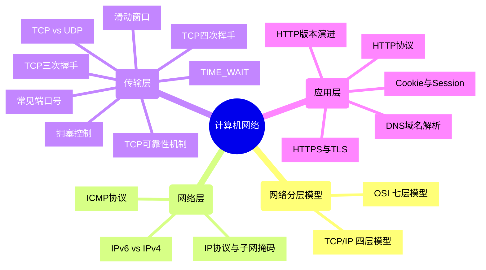

---
tags:
  - 计算机网络
  - 复习导图
  - 八股文
---

# 🌐 计算机网络 · 复习导图

> [!tip] 使用说明
> 1. 下方的 **思维导图** 提供全局知识脉络一览
> 2. **知识点清单** 中每个条目都可点击跳转到详细笔记 📎，遇到不懂的随时跳过去复习
> 3. 勾选 `[ ]` 复选框可以标记自己的复习进度

> [!info] 详细笔记总入口
> 📖 [[八股/计网 计组/计算机网络总览|计算机网络总览]] · [[八股/计网 计组/08-综合面试题/计网面试突击|计网面试突击]]

---

## 🗺️ 知识全景图

---

## 📚 知识点清单

### 一、网络分层模型 ★★★★

> 📎 详细笔记 → [[八股/计网 计组/01-网络体系结构/网络体系结构|网络体系结构]]

- [ ] OSI 七层模型（物理层、数据链路层、网络层、传输层、会话层、表示层、应用层）
- [ ] TCP/IP 四层模型（网络接口层、网络层、传输层、应用层）及各层协议

---

### 二、网络层 ★★★

> 📎 详细笔记 → [[八股/计网 计组/01-网络体系结构/网络体系结构|网络体系结构]]

- [ ] IP 协议的作用，IPv4 地址的分类与子网掩码
- [ ] ICMP 协议的作用（ping、traceroute 命令的原理）⬇️ *概率低，选择性学习*
- [ ] IPv6 与 IPv4 的区别 ⬇️ *概率低，选择性学习*

---

### 三、传输层 ★★★★★ 重点！！

> 📎 核心笔记 → [[八股/计网 计组/02-TCP连接管理/TCP连接管理|TCP连接管理]] · [[八股/计网 计组/03-TCP可靠传输/TCP可靠传输|TCP可靠传输]] · [[八股/计网 计组/04-传输层协议对比/TCP vs UDP|TCP vs UDP]]

#### 3.1 协议对比

> 📎 [[八股/计网 计组/04-传输层协议对比/TCP vs UDP|TCP vs UDP]]

- [ ] TCP 与 UDP 的区别（连接、可靠性、有序性、流量控制、拥塞控制、适用场景）

#### 3.2 TCP 连接管理

> 📎 [[八股/计网 计组/02-TCP连接管理/TCP连接管理|TCP连接管理]]

- [ ] TCP 三次握手过程及各阶段状态变化，为什么是三次？（防止历史连接）
- [ ] TCP 四次挥手过程及各阶段状态变化，为什么是四次？（半关闭状态）
- [ ] TCP 的 TIME_WAIT 状态的作用及优化方式

#### 3.3 TCP 可靠性机制

> 📎 [[八股/计网 计组/03-TCP可靠传输/TCP可靠传输|TCP可靠传输]]

- [ ] TCP 的可靠性保障（确认应答、序号、重传机制）
- [ ] TCP 的滑动窗口协议（流量控制原理）
- [ ] TCP 的拥塞控制算法（慢开始、拥塞避免、快速重传、快速恢复）

#### 3.4 常见端口号

- [ ] 80:HTTP、443:HTTPS、22:SSH、3306:MySQL 等

---

### 四、应用层 ★★★★★

> 📎 核心笔记 → [[八股/计网 计组/05-HTTP协议/HTTP协议详解|HTTP协议详解]] · [[八股/计网 计组/06-HTTPS与安全认证/HTTPS与TLS详解|HTTPS与TLS详解]] · [[八股/计网 计组/07-网络应用技术/DNS与CDN|DNS与CDN]]

#### 4.1 HTTP 协议

> 📎 [[八股/计网 计组/05-HTTP协议/HTTP协议详解|HTTP协议详解]]

- [ ] HTTP 协议的特点（无连接、无状态）及解决无状态的方案（Cookie、Session）
- [ ] HTTP 请求报文与响应报文的结构（请求行/响应行、请求头/响应头、请求体/响应体）
- [ ] HTTP 常见请求方法（GET、POST、PUT、DELETE、PATCH）的区别与使用场景
- [ ] HTTP 常见状态码（1xx 信息、2xx 成功、3xx 重定向、4xx 客户端错误、5xx 服务端错误）
- [ ] HTTP 1.0、1.1、2.0、3.0 的区别（长连接、管线化、多路复用、QUIC 等）

#### 4.2 HTTPS 与安全

> 📎 [[八股/计网 计组/06-HTTPS与安全认证/HTTPS与TLS详解|HTTPS与TLS详解]]

- [ ] HTTPS 的原理（HTTP + SSL/TLS），与 HTTP 的区别（安全性、端口、性能）

#### 4.3 DNS 域名解析

> 📎 [[八股/计网 计组/07-网络应用技术/DNS与CDN|DNS与CDN]]

- [ ] DNS 协议的作用（域名解析），解析过程（本地缓存、本地 DNS、根服务器等）

#### 4.4 Cookie 与认证

> 📎 [[八股/计网 计组/07-网络应用技术/Cookie与认证|Cookie与认证]]

- [ ] Cookie、Session、Token 的原理与区别

#### 4.5 从 URL 到页面

> 📎 [[八股/计网 计组/07-网络应用技术/从URL到页面|从URL到页面]]

- [ ] 完整的网页加载流程（DNS → TCP → HTTP → 渲染）

---

## 🔗 快速跳转

| 模块 | 笔记链接 |
|------|---------|
| 网络体系结构 | [[八股/计网 计组/01-网络体系结构/网络体系结构\|网络体系结构]] |
| TCP 连接管理 | [[八股/计网 计组/02-TCP连接管理/TCP连接管理\|TCP连接管理]] |
| TCP 可靠传输 | [[八股/计网 计组/03-TCP可靠传输/TCP可靠传输\|TCP可靠传输]] |
| TCP vs UDP | [[八股/计网 计组/04-传输层协议对比/TCP vs UDP\|TCP vs UDP]] |
| HTTP 协议详解 | [[八股/计网 计组/05-HTTP协议/HTTP协议详解\|HTTP协议详解]] |
| HTTPS 与 TLS | [[八股/计网 计组/06-HTTPS与安全认证/HTTPS与TLS详解\|HTTPS与TLS详解]] |
| DNS 与 CDN | [[八股/计网 计组/07-网络应用技术/DNS与CDN\|DNS与CDN]] |
| Cookie 与认证 | [[八股/计网 计组/07-网络应用技术/Cookie与认证\|Cookie与认证]] |
| 从 URL 到页面 | [[八股/计网 计组/07-网络应用技术/从URL到页面\|从URL到页面]] |
| 计网面试突击 | [[八股/计网 计组/08-综合面试题/计网面试突击\|计网面试突击]] |
